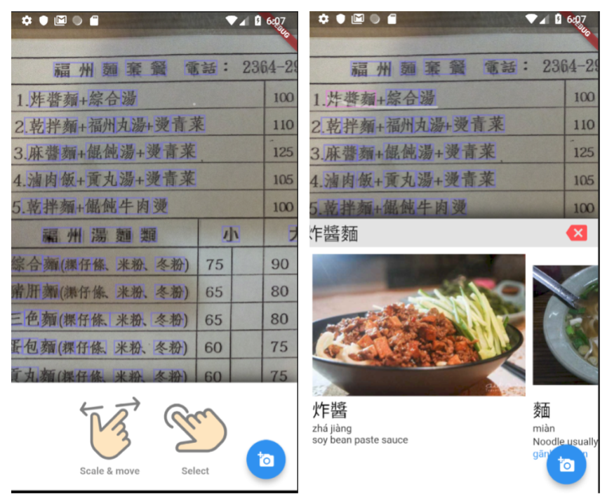

# food-vocabulary-app

When traveling or moving to another country ordering food at restourants/take-aways can be a challenge. Google Translate often is not very helpful when it comes to food translations. Ravioli is well understood english word but if you never had it before you need description and picture to understand.

Goal of this yet in-progress app is to build vocabulary for taiwanese food (and possibly other countries/languages in future) and interface to explore it.

[Download latest apk](https://api.codemagic.io/apps/5c1330a92a4964001862e063/builds/5c1343e0ec8f4c000d926e00/artefacts/app-release.apk)

[Download latest iOS app](https://api.codemagic.io/apps/5c1330a92a4964001862e063/builds/5c1343e0ec8f4c000d926e00/artefacts/Runner.app) (iOS is not yet tested - I don't have suitable device - so it most probably will break)

